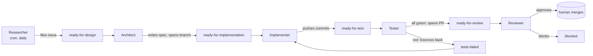

# Agentry

[](https://github.com/vinu-dev/agentry/actions/workflows/ci.yml)
[](https://www.python.org/downloads/)
[](LICENSE)


**Agentry is an autonomous orchestrator that runs a six-role software pipeline against your GitHub repo — Researcher, Architect, Implementer, Tester, Reviewer, Release Engineer — each backed by an LLM CLI of your choice (Claude Code, OpenAI Codex, or any wrapper on PATH).**

The agents are commodity workers. The orchestrator is the value: it keeps the pipeline running, supervises stalled subprocesses with a stream-JSON check-in protocol, gates expensive LLM runs behind cheap GitHub-label preflight checks, and turns a single config file into a continuously-shipping software team.

## Quickstart

```bash
# 1. Install host dependencies once per machine (Python, Node.js, claude, codex CLIs)
curl -fsSL https://raw.githubusercontent.com/vinu-dev/agentry/main/scripts/install-deps.sh | bash

# 2. Vendor agentry into your target repo (auto-detects target_repo from git remote)
cd ~/projects/your-repo && curl -fsSL https://raw.githubusercontent.com/vinu-dev/agentry/main/scripts/add-to-target.sh | bash

# 3. Run it
./agentry/start.sh
```

PowerShell equivalents in [Detailed setup](#detailed-setup).

## Why this exists

Most "AI software engineer" tools are single-agent loops (Auto-GPT, Devin, SWE-agent, in-IDE Cursor agents) that take one task at a time and try to finish it. Agentry takes a different shape:

- **Multi-role pipeline, not single agent.** Six specialized roles communicating through GitHub labels and PRs. Each role is small, replaceable, and runs on its own cron.
- **CLI-agnostic.** Each role names a CLI by binary (`claude`, `codex`, `npx ...`, your own wrapper). Swap providers per role to balance cost vs. judgment. No vendor lock-in.
- **Token-aware scheduling.** Trigger gates short-circuit a role's LLM run when no matching open issue or PR exists. The scheduler doesn't burn a model run to discover there's nothing to do.
- **Resumable, not stateful.** State lives in GitHub (issues, labels, branches, PRs) and per-role session-continuity files. Restart any role mid-pipeline; nothing is lost.

> **Mental model.** Agentry is a contractor you hire once. You give it a job description (`agentry/config.yml`). It supervises a team of LLM CLIs against your repo, retries the ones that stall, and writes its own audit trail into per-issue logs. You write your project's role rules in `docs/ai/roles/*.md` and let it run.

## Validation

Live smoke test against [`vinu-dev/rpi-home-monitor`](https://github.com/vinu-dev/rpi-home-monitor) — a Yocto-based home security camera distribution. The pipeline produced these public, externally-verifiable artifacts in roughly one day of runtime:

| Artifact | Count | Where |
|---|---|---|
| Issues filed by Researcher | **17** | [Issues #238–#254](https://github.com/vinu-dev/rpi-home-monitor/issues?q=is%3Aissue+label%3Aready-for-design%2Cready-for-implementation%2Cready-for-test+is%3Aopen) — each routed through the design queue with external sources cited |
| Design specs written by Architect | **2** | [`238-totp-2fa.md`](https://github.com/vinu-dev/rpi-home-monitor/blob/feature/238-totp-2fa/docs/history/specs/238-totp-2fa.md), [`239-outbound-webhooks.md`](https://github.com/vinu-dev/rpi-home-monitor/blob/feature/239-outbound-webhooks/docs/history/specs/239-outbound-webhooks.md) |
| Features implemented by Implementer | **1 (TOTP-2FA)** | [`feature/238-totp-2fa`](https://github.com/vinu-dev/rpi-home-monitor/tree/feature/238-totp-2fa) — service module, API blueprint, login template, model + audit changes, full unit-test suite |
| Pipeline state at pause | open queue | 1 `ready-for-test`, 1 `ready-for-implementation`, 15 `ready-for-design`, 0 `tests-failed` |

The smoke test is paused, not closed: queue and feature branches are intact and the next cycle resumes where it left off.

## How it works



One shared `feature/<id>-<slug>` branch per issue. Architect creates it; Implementer / Tester / Reviewer rebase on `origin/main` at the start of their cycle and force-push-with-lease. A code-owner human merges. Linear-history branch protection enforced.

Roles run isolated in per-role git worktrees (`agentry/worktrees/<role>/`) so concurrent cycles don't collide on a shared working tree. Stalls are handled via a stream-JSON `AGENTRY-CHECKIN:` protocol — the orchestrator asks "still working?" rather than killing on threshold, and the agent replies `STATUS:WORKING|DONE|BLOCKED|NEEDMORETIME`.

## Architecture overview

Agentry is **vendored into the target repo** as the `agentry/` folder, not installed as a system service. Each repo gets its own Python venv installed from the GitHub ref pinned in the start script. Run `./agentry/start.ps1` (or `.sh`) to start it; close the terminal to stop. **No NSSM, no systemd, no service install.** Reboot kills it; you start it again when you want it running.

```
your-target-repo/                       ← e.g. rpi-home-monitor
├── agentry/                            ← visible folder, vendored on demand
│   ├── config.yml                      ← committed: which CLI/model per role
│   ├── start.ps1 / start.sh            ← run this to start agentry
│   ├── .env.example                    ← copy to .env, fill GITHUB_TOKEN
│   ├── .gitignore
│   ├── .env                            ← gitignored
│   ├── .venv/                          ← gitignored, auto-created
│   ├── logs/                           ← gitignored
│   ├── state/                          ← gitignored
│   └── worktrees/                      ← gitignored, per-role git worktrees
├── docs/ai/roles/                      ← committed: per-role rule files
│   ├── researcher.md
│   ├── architect.md
│   ├── implementer.md
│   ├── tester.md
│   ├── reviewer.md
│   └── release.md
└── (your code)
```

**Where rule files live:** `docs/ai/roles/<role>.md` — the standard target-repo location, **NOT** inside `agentry/`. Edit those for project-specific instructions per role.

## Detailed setup

### 1. Once per machine — install dependencies

Installs Python, Node.js, Claude Code CLI, OpenAI Codex CLI. **Doesn't install agentry itself** (that goes per-target).

```powershell
# Windows
iwr -useb https://raw.githubusercontent.com/vinu-dev/agentry/main/scripts/install-deps.ps1 | iex
```

```bash
# Linux
curl -fsSL https://raw.githubusercontent.com/vinu-dev/agentry/main/scripts/install-deps.sh | bash
```

Then authenticate the LLM CLIs (each opens your browser):

```
claude login
codex login
```

### 2. Once per target repo — vendor `agentry/` into it

From inside the target:

```powershell
# Windows
cd C:\projects\rpi-home-monitor
iwr -useb https://raw.githubusercontent.com/vinu-dev/agentry/main/scripts/add-to-target.ps1 | iex
```

```bash
# Linux
cd ~/projects/rpi-home-monitor
curl -fsSL https://raw.githubusercontent.com/vinu-dev/agentry/main/scripts/add-to-target.sh | bash
```

This downloads the `agentry/` folder skeleton + role rule file skeletons into the target. Auto-detects `target_repo` from the git remote.

You then:

1. Copy `agentry/.env.example` to `agentry/.env` and fill in your `GITHUB_TOKEN` (or rely on `gh` CLI keyring auth).
2. Edit `agentry/config.yml` if you want to change which CLI handles which role.
3. (Optional) Edit `docs/ai/roles/*.md` for project-specific instructions.

### 3. Every time you want it running — start it

```powershell
# Windows
cd C:\projects\rpi-home-monitor
.\agentry\start.ps1
```

```bash
# Linux
cd ~/projects/rpi-home-monitor
./agentry/start.sh
```

First run: creates `agentry/.venv/`, pip-installs agentry into it. Subsequent runs: just activates the venv and starts the orchestrator (re-installs only when the pinned ref changes). Foreground; Ctrl-C to stop.

## What you actually edit per role

Open `agentry/config.yml`. Each role looks roughly like this:

```yaml
target_repo: vinu-dev/rpi-home-monitor
isolate_worktrees: true

agents:
  implementer:
    cli: claude
    args: ["-p", "--input-format=stream-json", "--output-format=stream-json", "--verbose", "--dangerously-skip-permissions"]
    interval_min: 5
    total_min: 60
    stall_min: 60
    trigger:
      issue_labels: ["ready-for-implementation", "tests-failed"]
    prompt: |
      You are the Implementer. Read docs/ai/roles/implementer.md and follow it.
  # ... etc for the other 5 roles
```

Change `cli:` to switch which LLM handles each role. The `trigger:` block is a cheap GitHub preflight — the LLM is only spawned when there's matching open work, so idle roles cost nothing. The prompt points at `docs/ai/roles/<role>.md` — your project-specific instructions for that role.

## Watching what it does

Per-role logs land in your target at `agentry/logs/<role>/<timestamp>.log`. Tail with `tail -f` (or `Get-Content -Wait` on Windows), or run `agentry status` from the target dir for a per-role summary.

If `DISCORD_WEBHOOK_URL` is set in your `.env`, agent lifecycle events also go there (started / exited / stalled / timed-out / no-work), batched 60s.

## Tech stack

Python 3.11+ · Click · pydantic · subprocess supervision · git worktrees · stream-JSON Claude protocol · `gh` CLI for GitHub operations.

## Removing agentry from a target repo

Just delete the `agentry/` folder and (optionally) `docs/ai/roles/`. That's the entire uninstall.

## Removing dependencies from your machine

```powershell
# Windows
winget uninstall OpenJS.NodeJS.LTS
npm uninstall -g @anthropic-ai/claude-code @openai/codex
```

```bash
# Linux — depends on your distro
apt remove nodejs npm                   # debian/ubuntu
npm uninstall -g @anthropic-ai/claude-code @openai/codex
```

To sign out of subscription credentials: `claude logout`, `codex logout`.

## License

AGPL-3.0-or-later — see [LICENSE](LICENSE).

## More

- [`docs/architecture.md`](docs/architecture.md) — design and architecture
- [`docs/how-to-use.md`](docs/how-to-use.md) — operator's guide (longer-form)
- [`COMPATIBILITY-SPEC.md`](COMPATIBILITY-SPEC.md) — what target repos must provide
- [`docs/examples/medical-device/`](docs/examples/medical-device/) — extended 11-role example for regulated software (IEC 62304, ISO 13485, FDA 21 CFR 820)
