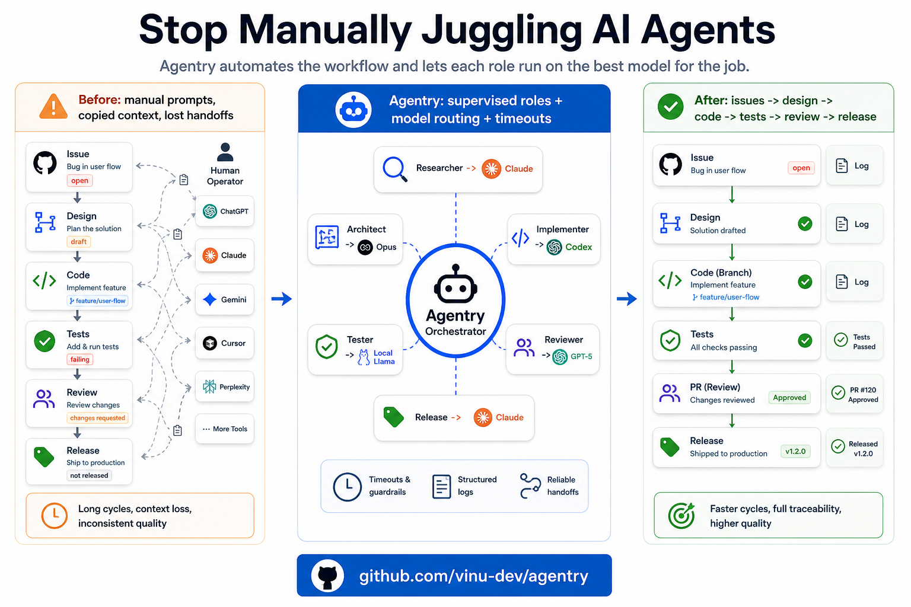

# Agentry



Agentry is an autonomous multi-agent product organization. It runs continuously against a target GitHub repository and ships features through a pipeline of specialized roles — Researcher, Architect, Implementer, Tester, Reviewer, Release Engineer — each backed by an LLM CLI of your choice (Claude Code, OpenAI Codex CLI, or any wrapper script you can put on PATH).

The agents are commodity workers. The orchestrator is the value: it keeps the pipeline running, restarts agents that stall, and turns a few-line config file into a continuously-shipping software team.

> **Mental model.** Agentry is a contractor you hire once. You give it a job description (`agentry/config.yml`). It hires gig workers from the AI spot market — Anthropic, OpenAI, your local Llama. It supervises them, fires the ones that don't work, calls in backups. You write your project's role rules in `docs/ai/roles/*.md` and let it run.

## How it's used — gtest-style

Agentry is a **dependency you pull into your target repo**, not a system service. Each repo gets its own `agentry/` folder with a Python venv installed from the GitHub ref pinned in the start script. Run `./agentry/start.ps1` (or `.sh`) to start it; close the terminal to stop. **No NSSM, no systemd, no service install.** Reboot kills it; you start it again when you want to work.

```
your-target-repo/                       ← e.g. rpi-home-monitor
├── agentry/                            ← visible folder, fetched on demand
│   ├── config.yml                      ← committed: which model per role
│   ├── start.ps1 / start.sh            ← run this to start agentry
│   ├── .env.example                    ← copy to .env, fill GITHUB_TOKEN
│   ├── .gitignore
│   ├── .env                            ← gitignored
│   ├── .venv/                          ← gitignored, auto-created
│   ├── logs/                           ← gitignored
│   └── state/                          ← gitignored
├── docs/ai/roles/                      ← committed: per-role rule files
│   ├── researcher.md
│   ├── architect.md
│   ├── implementer.md
│   ├── tester.md
│   ├── reviewer.md
│   └── release.md
└── (your code)
```

**Where rule files live:** `docs/ai/roles/<role>.md` — the standard target-repo location, **NOT** inside `agentry/`. Edit those for project-specific instructions per role.

## Setup — three scripts, three contexts

### 1. Once per machine — install dependencies

Installs Python, Node.js, Claude Code CLI, OpenAI Codex CLI. **Doesn't install agentry itself** (that goes per-target).

```powershell
# Windows
iwr -useb https://raw.githubusercontent.com/vinu-dev/agentry/main/scripts/install-deps.ps1 | iex
```

```bash
# Linux
curl -fsSL https://raw.githubusercontent.com/vinu-dev/agentry/main/scripts/install-deps.sh | bash
```

Then authenticate the LLM CLIs (each opens your browser):

```
claude login
codex login
```

### 2. Once per target repo — drop agentry/ into it

From inside the target:

```powershell
# Windows
cd C:\projects\rpi-home-monitor
iwr -useb https://raw.githubusercontent.com/vinu-dev/agentry/main/scripts/add-to-target.ps1 | iex
```

```bash
# Linux
cd ~/projects/rpi-home-monitor
curl -fsSL https://raw.githubusercontent.com/vinu-dev/agentry/main/scripts/add-to-target.sh | bash
```

This downloads the `agentry/` folder skeleton + role rule file skeletons into the target. Auto-detects `target_repo` from the git remote.

You then:

1. Copy `agentry/.env.example` to `agentry/.env` and fill in your `GITHUB_TOKEN`
2. Edit `agentry/config.yml` or run the GUI if you want to change which CLI/model handles which role (default: optimized Codex model tiers)
3. (Optional) Edit `docs/ai/roles/*.md` for project-specific instructions

### 3. Every time you want it running — start it

```powershell
# Windows
cd C:\projects\rpi-home-monitor
.\agentry\start.ps1
```

```bash
# Linux
cd ~/projects/rpi-home-monitor
./agentry/start.sh
```

First run: creates `agentry/.venv/`, pip-installs agentry into it. Subsequent runs: just activates the venv and starts the orchestrator. Foreground; Ctrl-C to stop.

To configure without starting agents:

```powershell
# Windows
.\agentry\start.ps1 gui --target .
```

```bash
# Linux
./agentry/start.sh gui --target .
```

The dashboard shows role sessions, latest logs, token budget state, and Stop
buttons. It also writes the recommended config options: `manual`, `pipeline`,
or `autonomous` mode; Researcher and Release toggles; and balanced/cheap/strong
model profiles. `pipeline` is the default, so Agentry processes existing GitHub
labels but does not let Researcher create new issues.

## What you actually edit per role

Open `agentry/config.yml`. Looks like this:

```yaml
target_repo: vinu-dev/rpi-home-monitor

agents:
  researcher:
    cli: npx
    args: ["--yes", "@openai/codex", "exec", "-m", "gpt-5.4-mini", "--dangerously-bypass-approvals-and-sandbox"]
    interval_min: 60
    total_min: 30
    stall_min: 30
    token_budget: 20000
    prompt: |
      You are the Researcher. Read docs/ai/roles/researcher.md and follow it.
      If that file doesn't exist, exit with error.

  implementer:
    cli: npx
    args: ["--yes", "@openai/codex", "exec", "-m", "gpt-5.4", "--dangerously-bypass-approvals-and-sandbox"]
    interval_min: 5
    total_min: 60
    stall_min: 60
    token_budget: 60000
    prompt: |
      You are the Implementer. Read docs/ai/roles/implementer.md and follow it.
  # ... etc for the other 4 roles
```

Change the `cli:` field to switch which LLM handles each role. The prompt points at a rule file in `docs/ai/roles/` — your project-specific instructions for that role.

## Watching what it does

Per-role logs land in your target at `agentry/logs/<role>/<timestamp>.log`. Tail with `tail -f` (or `Get-Content -Wait` on Windows), run `agentry status --target .`, or open `agentry gui --target .` for a per-role summary.

Stop everything safely with:

```powershell
.\agentry\start.ps1 stop --target . --all
```

```bash
./agentry/start.sh stop --target . --all
```

If `DISCORD_WEBHOOK_URL` is set in your `.env`, agent lifecycle events also go there (started / exited / stalled / timed-out), batched 60s.

## Removing agentry from a target repo

Just delete the `agentry/` folder and (optionally) `docs/ai/roles/`. That's the entire uninstall.

## Removing dependencies from your machine

```powershell
# Windows
winget uninstall OpenJS.NodeJS.LTS
npm uninstall -g @anthropic-ai/claude-code @openai/codex
```

```bash
# Linux — depends on your distro
apt remove nodejs npm                   # debian/ubuntu
npm uninstall -g @anthropic-ai/claude-code @openai/codex
```

To sign out of subscription credentials: `claude logout`, `codex logout`.

## License

See [LICENSE](LICENSE).

## More

- [`docs/architecture.md`](docs/architecture.md) — design and architecture
- [`docs/how-to-use.md`](docs/how-to-use.md) — operator's guide (longer-form)
- [`COMPATIBILITY-SPEC.md`](COMPATIBILITY-SPEC.md) — what target repos must provide
- [`docs/examples/medical-device/`](docs/examples/medical-device/) — extended 11-role example for regulated software (IEC 62304, ISO 13485, FDA 21 CFR 820)
