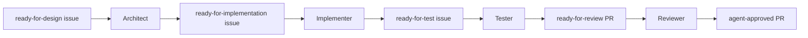

# Agentry Architecture

Agentry is a per-repository AI product-team runner. It is not installed as a
machine-wide service. Each target repository carries its own `agentry/` folder,
start scripts, config, role rules, logs, state, and Python virtual environment.

The durable workflow state lives in GitHub: issues, labels, branches, pull
requests, reviews, and releases. Local Agentry state is only for process
supervision and operator visibility.

## System Shape

```text
target-repo/
  agentry/
    config.yml
    start.ps1
    start.sh
    .env.example
    .env              # local, gitignored
    .venv/            # local, gitignored
    logs/             # local, gitignored
    state/            # local, gitignored
  docs/ai/roles/
    researcher.md
    architect.md
    implementer.md
    tester.md
    reviewer.md
    release.md
```

The machine only needs Python, Node.js, the selected LLM CLIs, Git, and GitHub
auth. The target repo owns the project-specific rules.

## Core Components

| Module | Responsibility |
|--------|----------------|
| `cli.py` | `doctor`, `start`, `status`, `stop`, `configure`, `gui`, `default-paths` |
| `config.py` | Load/validate `agentry/config.yml` and resolve target paths |
| `configure.py` | Apply recommended modes, model profiles, budgets, and role toggles |
| `dashboard.py` | Local HTTP status/configuration dashboard |
| `orchestrator.py` | Starts one role loop per allowed role |
| `supervisor.py` | Spawns LLM CLIs, watches stdout, handles timeouts/check-ins |
| `session.py` | Writes session JSON, detects stale sessions, stops process trees |
| `github.py` | Cheap GitHub label/PR checks and label initialization |
| `notify.py` | Optional Discord lifecycle notifications |

## Run Modes

The top-level `mode` in `agentry/config.yml` controls how much autonomy is
allowed.

| Mode | Behavior |
|------|----------|
| `manual` | Start no role loops. Useful for inspection, config, and safe pause. |
| `pipeline` | Default. Process existing GitHub labels, but do not create new research issues. |
| `autonomous` | Pipeline plus Researcher, only when `research.allow_create_issues: true`. |

This makes the "create new work" switch explicit. A target can keep Agentry
running on existing tickets without letting it grow the backlog.

## Role Loop

Each allowed role is a lightweight scheduler loop:

1. Check for an active local session for that role.
2. Check cheap GitHub triggers, such as open issues or PRs with matching labels.
3. Prepare the role working directory, usually a per-role git worktree.
4. Build the role prompt from `agentry/config.yml`.
5. Spawn the configured CLI and supervise it.
6. Record session outcome, tokens, duration, and log path.
7. Back off on model limit exhaustion when the reset time can be parsed.
8. Sleep until the next interval.

If there is no matching GitHub work, no LLM process is started.

## GitHub As The Queue

Agentry does not need a separate scheduler brain for stage transitions. Roles
move work by changing GitHub labels.



Each role handles one work item per run in the bundled standard workflow. The
next role wakes only when GitHub contains the label it watches.

## Sessions And Watchdog State

Agentry writes one runtime session file per role:

```text
agentry/state/sessions/<role>.json
```

The file records:

- `state`: `running`, `completed`, `stale`, `stopped`, `blocked`, etc.
- subprocess PID
- start, last-output, and finish timestamps
- role mode
- log path
- exit reason and exit code
- duration
- token usage and token budget

Before launching a role, the orchestrator checks the session file. If it still
points to a live `running` PID, the launch is skipped. If the PID is gone, the
session is marked `stale` and the role can run again.

This is what makes restart recovery simple: after a reboot, old session files do
not cause token burn and do not permanently block work.

## Stop Behavior

Agentry is normally stopped by pressing Ctrl-C or closing the foreground
terminal. The operator can also run:

```bash
agentry stop --target . ROLE
agentry stop --target . --all
```

The dashboard uses the same stop APIs.

Stop is conservative. Agentry only kills a PID if the session is still marked
`running` and the PID is alive. Completed or stale session records are not used
to kill processes, which protects against PID reuse after reboot.

On Windows, Agentry uses `taskkill /T /F /PID <pid>`. On Linux, supervised
roles run in their own process group, and Agentry sends SIGTERM followed by
SIGKILL only if the process group does not exit.

## Supervisor Modes

The supervisor supports two CLI styles.

Legacy mode works with any one-shot CLI or local wrapper. Agentry writes the
initial prompt once, reads stdout, and enforces `stall_min` and `total_min`.

Stream-JSON mode supports CLIs that keep stdin open and emit assistant text
events. When a stall or total threshold is reached, Agentry sends an
`AGENTRY-CHECKIN:` message. The agent replies with:

```text
STATUS:WORKING
STATUS:DONE
STATUS:BLOCKED <reason>
STATUS:NEEDMORETIME <minutes>
```

Killing is the fallback for no response, not the first move.

## Cross-Platform Model/CLI Assignment

Each role has its own `cli` and `args`, so different roles can use different
models or providers:

```yaml
agents:
  architect:
    cli: npx
    args: ["--yes", "@openai/codex", "exec", "-m", "gpt-5.4"]
  tester:
    cli: npx
    args: ["--yes", "@openai/codex", "exec", "-m", "gpt-5.4-mini"]
  reviewer:
    cli: claude
    args: ["-p", "--dangerously-skip-permissions"]
```

Agentry resolves common npm shims across Windows and Linux. A config that says
`npx` can run as `npx.cmd` on Windows, and a copied Windows config that says
`npx.cmd` can resolve to `npx` on Linux.

## Dashboard

`agentry gui --target .` starts a local dashboard on `127.0.0.1:4783` by
default. It shows:

- target repo and run mode
- role enabled/mode-allowed state
- latest session state
- PID, tokens, start time, and log tail
- per-role Stop and Stop All controls
- configuration controls for mode, model profile, Researcher, Release Engineer,
  auto-merge flag, and stop-when-empty flag

The generated start scripts can launch the GUI without starting role loops:

```powershell
.\agentry\start.ps1 gui --target .
```

```bash
./agentry/start.sh gui --target .
```

## Versioning

`scripts/add-to-target.*` writes start scripts into the target repo and stamps a
Git ref into them. Fresh `agentry/.venv/` installs use that ref, not mutable
`main`, unless `AGENTRY_INSTALL_REF` is explicitly set.

This keeps target repos reproducible.

## Extension Model

The standard roster is:

```text
researcher -> architect -> implementer -> tester -> reviewer -> release
```

Regulated or security-heavy projects can add roles such as:

```text
risk_analyst
quality_reviewer
cybersecurity_reviewer
regulatory_reviewer
traceability_tracker
security_reviewer
docs_writer
performance_tester
```

The framework does not care how many roles exist. It starts one loop per enabled
role allowed by the current run mode.
