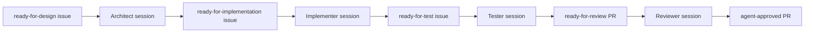

# Watchdog and Dashboard Design

Agentry is meant to be started by a human when work should happen, then stopped
by closing the terminal, pressing Ctrl-C, or using the dashboard/CLI stop
controls. It is not a service daemon by default. A reboot stops it; the operator
starts it again with the target repo's `agentry/start.ps1` or `agentry/start.sh`.

## Goals

- Run one active session per role so tokens are not burned by accidental
  duplicate agents.
- Use GitHub labels as the durable workflow queue.
- Keep runtime state inside the target repo under `agentry/state/`.
- Show role status, logs, token counts, and stop controls in a local dashboard.
- Work on Windows and Linux with the same target config.
- Survive crashes, reboots, stale state files, missing CLIs, and exhausted model
  limits without silently spinning.

## Run Modes

`agentry/config.yml` has a top-level `mode`.

| Mode | Behavior |
|------|----------|
| `manual` | No role threads are started. Use this to inspect status or keep the repo quiet. |
| `pipeline` | Default. Process existing GitHub labels. Researcher is blocked so no new issues are created. |
| `autonomous` | Pipeline plus Researcher, but only when `research.allow_create_issues: true` and researcher is enabled. |

This keeps the dangerous switch explicit. Enabling the Researcher in the role
config is not enough by itself; autonomous mode and the research gate must also
be on.

## Role Sessions

Every role writes a session file:

```text
agentry/state/sessions/<role>.json
```

The record includes:

- role, mode, state
- PID when a subprocess has spawned
- start, last-output, and finish timestamps
- log path
- exit reason and exit code
- duration
- tokens used, token budget, and whether the budget was exceeded

Before launching a role, the orchestrator checks for an active session. If a
running session file exists and the PID is still alive, the role is skipped until
the next interval. If the PID no longer exists, the session is marked `stale` and
the role may run again.

This handles normal crash/reboot recovery: old JSON files are harmless, and the
next Agentry start cleans them up lazily.

## Stop Safety

Stop controls are deliberately conservative.

- `agentry stop --target . ROLE` stops one running role.
- `agentry stop --target . --all` stops all running roles known to session
  state.
- The dashboard exposes the same per-role and all-role stop operations.
- Ctrl-C on `agentry start` sets the orchestrator shutdown event and lets the
  supervisor interrupt any in-flight subprocess.

Agentry only kills a PID when the session is still marked `running` and the PID
is alive. Completed or stale sessions are not killed, which avoids killing an
unrelated process after a reboot or PID reuse.

On Windows, stop uses `taskkill /T /F /PID <pid>` so child processes are also
terminated. On Linux, supervised roles run in their own process group; stop
sends SIGTERM to that process group, waits briefly, then uses SIGKILL only if
needed.

## Check-Ins and Limits

Two supervision modes exist:

- Legacy CLI mode: Agentry sends the prompt once, reads stdout, and enforces
  `stall_min` and `total_min`.
- Stream-JSON mode: for CLIs/wrappers that keep stdin open and emit structured
  assistant text, Agentry sends an `AGENTRY-CHECKIN:` message before killing.

The check-in response must contain one status line:

```text
STATUS:WORKING
STATUS:DONE
STATUS:BLOCKED <reason>
STATUS:NEEDMORETIME <minutes>
```

This lets Claude-style or wrapper-based agents say whether they are still
working. Plain one-shot CLIs and local LLM wrappers still work; they simply use
the legacy watchdog path.

Codex usage-limit messages are detected in role logs. When Agentry sees a reset
time, it backs that role off until after the reset instead of hammering the CLI.
Each role also has a soft `token_budget`; exceeding it is recorded in the
session and shown by status/dashboard.

## Cross-Platform CLI Resolution

Configs can use portable command names like `npx`, `claude`, `codex`, or wrapper
scripts. The supervisor resolves npm shims across platforms:

- Windows can resolve `npx` to `npx.cmd`.
- Linux can tolerate a copied Windows config that says `npx.cmd` by trying
  `npx`.
- Absolute paths still work.

The same resolver is used by `agentry doctor`, so warnings match runtime
behavior.

## Dashboard

Start the local dashboard from a target repo:

```powershell
.\agentry\.venv\Scripts\agentry.exe gui --target .
```

```bash
./agentry/.venv/bin/agentry gui --target .
```

The dashboard listens on `127.0.0.1:4783` by default. It shows:

- target repo and run mode
- role enabled/mode-allowed state
- current or latest session state
- PID, token counts, start time, and latest log tail
- per-role Stop and Stop All buttons
- a Configure tab for run mode, model profile, Researcher, Release Engineer,
  auto-merge flag, and stop-when-empty flag

The GUI writes `agentry/config.yml` using the same helper as the CLI wizard.

## Self-Sustaining Flow

Agentry does not need a separate "brain" to decide the next stage. GitHub is the
queue:



Each role handles one item per run and updates GitHub. On the next scheduler
tick, cheap label checks decide whether the next role should run. If there is no
matching issue or PR, no LLM is spawned.

## Corner Cases

| Scenario | Behavior |
|----------|----------|
| Computer restarts | Foreground Agentry process is gone. Next manual start sees old sessions, marks dead PIDs stale, and continues. |
| Terminal is closed | Same as restart; no service keeps burning tokens. |
| Two starts happen accidentally | Each role sees the active session file and skips while that PID is alive. |
| PID is reused after a crash | Completed/stale sessions are not killed by stop commands. |
| CLI missing | `doctor` warns; runtime records `spawn-failed` and retries later. |
| GitHub has no matching label | The cheap scheduler check skips the LLM run. |
| Researcher should not create work | Keep `mode: pipeline` or `manual`; Researcher is blocked even if enabled. |
| Model limit is exhausted | Usage-limit logs trigger a backoff until the reset time or a four-hour fallback. |
| Token use is high | Role session records budget exceeded; status/dashboard show it for tuning. |
| Local LLM or wrapper does not support check-ins | It still runs under legacy stdout/timeout supervision. |
